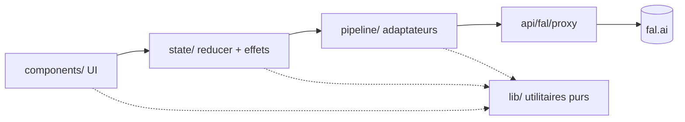
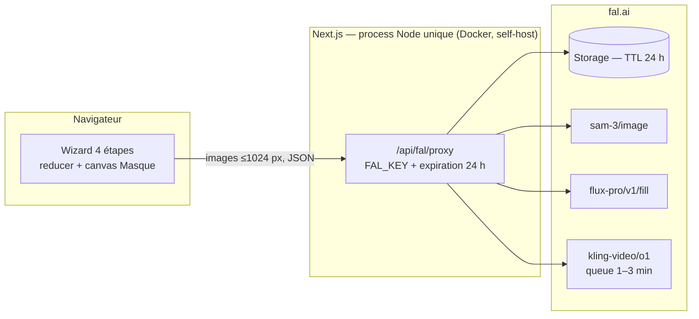

# Architecture Spine — RoomReveal

## Design Paradigm

**Pipeline piloté client sur BFF proxy sans état.** Le Parcours (Upload → Masque → Pièce vide → Vidéo) est une machine à états qui vit intégralement dans le navigateur ; le serveur Next.js se réduit à un proxy fal.ai qui garde la clé et injecte la politique d'expiration. Aucune base de données, aucune session, aucun fichier serveur.

Couches → répertoires :

| Couche | Répertoire | Rôle |
| --- | --- | --- |
| Surfaces UI | `src/components/` | Les 7 surfaces UX ; dispatchent des intentions, ne tiennent aucun état pipeline |
| Machine à états | `src/state/` | Le reducer unique de la Génération : transitions, invalidation, erreurs |
| Pipeline | `src/pipeline/` | Seul propriétaire de fal : un adaptateur par étape, config modèles, prompts |
| Proxy | `src/app/api/fal/proxy/` | `@fal-ai/server-proxy` — clé + header d'expiration, rien d'autre |

## Invariants & Rules



Sens des dépendances strict : une flèche = « peut importer ». Jamais l'inverse, jamais de saut de couche (l'UI n'importe jamais `pipeline/` ni `@fal-ai/client`). `lib/` est une couche feuille : importable par toutes, elle n'importe ni `pipeline/` ni `@fal-ai/client`.

### AD-1 — Invariant produit FLF `[ADOPTED — PRD §5, contractuel]`

- **Binds:** all
- **Prevents:** remplacer la génération contrainte par une génération vidéo libre ; retoucher la Photo originale
- **Rule:** ordre du pipeline fixe (Détection → Inpainting → Génération FLF) ; première frame = Pièce vide, dernière frame = Photo originale strictement intouchée. Tout modèle vidéo de remplacement doit offrir un mode FLF dédié (start **et** end frame contraints) — jamais d'image-to-video simple ni de « tail image » indicatif.

### AD-2 — Espace de pixels canonique

- **Binds:** FR-2, FR-5..FR-8, FR-10
- **Prevents:** mismatch de dimensions entre éditeur de Masque, inpainting et frames vidéo ; crop ou déformation de la Révélation
- **Rule:** un seul redimensionnement, côté client, à l'upload (côté long ≤ 1024 px, ratio préservé), encodé une seule fois en `image/jpeg` qualité 0,92 `[à calibrer au build]` — jamais ré-encodé ensuite. Cette **photo canonique** est LA « Photo originale » au sens du pipeline : « intouchée » (AD-1) signifie aucune retouche de contenu après canonisation ; le `File` d'origine est jeté après resize. Masque, Pièce vide et frames FLF partagent exactement les dimensions canoniques. La Révélation conserve le ratio de la photo canonique de bout en bout — jamais de crop vers un 16:9 forcé (le « 16:9 supposé » de l'UX est écarté : une photo 4:3 donne une vidéo 4:3). Résolution de sortie : le tier le plus haut du modèle ≤ 1080p pour ce ratio ; framerate natif du modèle (≥ 24 fps, pas de transcodage — voir Deferred si FR-10 exige 24 fps exactement). `[ASSUMPTION : le modèle FLF préserve le ratio d'entrée — critère d'acceptation de tout modèle vidéo au même titre que le mode FLF d'AD-1 ; à vérifier au build sur photo 4:3]`

### AD-3 — État client unique, serveur sans état

- **Binds:** all
- **Prevents:** deux sources de vérité (session serveur vs état navigateur) ; toute persistance implicite
- **Rule:** la Génération est un objet unique tenu par un reducer React ; le serveur ne persiste rien (ni DB, ni session, ni fichier). Perte au rafraîchissement assumée (décision UX). Aucun composant ne tient d'état pipeline local — le brouillon du Masque **est** de l'état pipeline (AD-13), pas de l'état d'interaction UI. Forme canonique : `generation = { step, epoch, originalPhoto: { blob, falUrl? }, maskDraft, mask?: URL, emptyRoom?: URL, reveal?: URL, waitPhase?, error? }`. Si la rétention 24 h déléguée à fal (AD-9) s'avérait inopérante au build, le repli (stockage serveur + purge) n'est **pas** une décision locale : c'est un amendement de spine obligatoire — il renverse cette AD.

### AD-4 — La clé ne sort jamais, tout trafic fal passe par le proxy

- **Binds:** all, NFR-4
- **Prevents:** fuite de `FAL_KEY` ; appels fal directs dispersés
- **Rule:** `FAL_KEY` vit uniquement dans l'environnement serveur ; tout appel **API** fal (modèles, queue, upload storage) passe par `/api/fal/proxy`. Le proxy n'est pas un relais ouvert : il n'autorise que les endpoints du registre `pipeline/config.ts` (allowlist), et l'instance démo vit sur un réseau privé — sans quoi n'importe qui dépense `FAL_KEY`. Le chargement direct des URLs publiques du storage fal (affichage des images, lecteur vidéo, téléchargement du MP4) est permis — ce sont des GET non authentifiés. Les politiques transverses (expiration AD-9) sont posées dans `pipeline/`, le proxy les forwarde (headers `x-fal-*`).

### AD-5 — Le module pipeline est le seul propriétaire des appels modèles

- **Binds:** FR-4, FR-8, FR-10, FR-17
- **Prevents:** trois intégrations fal incompatibles (une par étape) ; IDs de modèles en dur dans l'UI
- **Rule:** `src/pipeline/` est le **seul importeur** de `@fal-ai/client`, upload storage compris : il expose `uploadArtifact(blob) → URL fal` en plus des trois adaptateurs (`detect`, `inpaint`, `video`), tous derrière la même interface passive (AD-12) avec erreurs normalisées (AD-8). Les couches amont manipulent des `Blob` locaux jusqu'à la frontière pipeline ; toute URL fal naît dans `pipeline/`. Les trois adaptateurs ne consomment que des URLs fal — seul `uploadArtifact` accepte un `Blob` (la couche effectrice uploade une fois, mémoïse dans `generation`) : `detect(photoUrl)`, `inpaint(photoUrl, maskUrl)`, `video(emptyRoomUrl, photoUrl)`. Contrat de sortie de `detect` : `{ initialMask: <PNG binaire unique, dimensions et sémantique AD-2/AD-7> | null, categories: string[] }` — la composition des N segments SAM (union, seuil de confiance, mise aux dimensions canoniques) appartient à `detect`, jamais à l'UI ni au reducer ; `initialMask === null` est LA définition canonique du cas FR-16 ; `categories` reste interne, jamais exposée en UI (décision UX canonique). Les IDs de modèles sont référencés par rôle dans un module de config unique — changer de modèle = éditer ce fichier, rien d'autre.

### AD-6 — Prompts centralisés `[ADOPTED — addendum brief/PRD]`

- **Binds:** FR-4, FR-8, FR-10
- **Prevents:** prompts dispersés dans le code
- **Rule:** tous les prompts modèles (liste meubles SAM 3, prompt pièce-vide, prompt de mouvement du preset « mix côtés + plafond ») vivent dans un seul fichier facilement éditable (`src/pipeline/prompts.ts`).

### AD-7 — Le Masque validé part verbatim

- **Binds:** FR-7, SM-2
- **Prevents:** post-traitement « utile » du masque (dilation, blur, morphologie) qui violerait SM-2 (respect à 100 %)
- **Rule:** le masque validé est transmis à l'inpainting sans aucune altération, même si la qualité d'inpainting en profiterait. Le Masque est **binaire** : chaque pixel vaut 0 ou 255, aucune valeur intermédiaire — dessin sans anti-aliasing (composition binaire au trait), jamais de binarisation différée à l'export : ce que l'utilisateur voit est exactement ce qui part. Le buffer d'édition vit en résolution canonique 1:1 (AD-2) pendant toute l'édition ; zoom et devicePixelRatio sont des transformations d'affichage, jamais de rééchantillonnage du buffer. Format de l'artefact : PNG, blanc = zone à effacer, dimensions strictement égales à l'image canonique.

### AD-8 — Taxonomie d'erreurs unique

- **Binds:** FR-17, FR-16
- **Prevents:** trois gestions d'erreur incompatibles ; traces fal brutes en UI
- **Rule:** tout échec d'adaptateur devient un `StepError { step, retryable, userMessage }` (userMessage en français, vocabulaire du glossaire). `step` est typé sur l'enum pipeline `'detect' | 'inpaint' | 'video'` ; le reducer possède la table de correspondance canonique vers les surfaces du Parcours (`detect` → surface Masque, relance = re-détection depuis la photo canonique conservée ; `inpaint` → Pièce vide ; `video` → Vidéo). Le timeout est détecté **par l'adaptateur seul** (valeurs par étape dans `pipeline/config.ts` — detect/inpaint 60 s, video 6 min `[à calibrer au build]`), converti en `StepError { retryable: true }` ; l'UI ne pose jamais de chronomètre d'échec — le seuil UX « 3 min 30, message doux » est un pur affichage sur temps écoulé, sans effet sur le job. L'UI ne voit jamais une erreur fal native. La relance est toujours limitée à l'étape concernée ; les artefacts amont sont conservés. « Aucun meuble détecté » (`initialMask === null`, AD-5) n'est **pas** une erreur : c'est un résultat qui ouvre le fallback manuel (FR-16).

### AD-9 — Artefacts éphémères délégués au storage fal

- **Binds:** NFR-4
- **Prevents:** stockage applicatif parallèle (disque + cron) divergent de la promesse « purge 24 h »
- **Rule:** tous les artefacts (photo canonique, masque, Pièce vide, Révélation) vivent sur le storage fal ; `pipeline/` pose `X-Fal-Object-Lifecycle-Preference: {"expiration_duration_seconds": 86400}` sur **chaque requête** (option headers de `@fal-ai/client`, forwardée par le proxy) — uploads **et** requêtes de génération : la doc fal confirme que sorties et entrées suivent les mêmes contrôles de rétention (vérifié web 2026-07-10 ; sans le header, rétention par défaut ≥ 7 jours). L'application ne copie rien ; les URLs fal sont périssables — le MP4 se télécharge depuis l'URL fal, jamais re-hébergé (téléchargement = fetch client → Blob → objectURL, l'attribut `download` étant ignoré en cross-origin ; jamais de route serveur de relais).

### AD-10 — Jobs longs via la queue fal, côté client

- **Binds:** FR-10, FR-14
- **Prevents:** double mécanisme d'attente (webhook serveur vs polling client)
- **Rule:** les appels longs passent par `fal.subscribe` (queue + polling de statut) depuis le navigateur via le proxy. Pas de webhook, pas d'orchestration serveur — l'attente se vit sur la page (décision UX). Les événements de statut queue alimentent les phases nommées du Panneau d'attente.

### AD-11 — Sémantique d'invalidation du Parcours

- **Binds:** FR-9, FR-15, FR-17
- **Prevents:** deux interprétations de « retour en arrière » (qui survit, qui meurt)
- **Rule:** définie dans le reducer seul. Revenir en arrière conserve tous les artefacts existants ; **avancer à nouveau** depuis une étape antérieure invalide les artefacts en aval (après confirmation, décision UX). « Régénérer » remplace la Pièce vide sans toucher au Masque — c'est une invalidation d'aval : toute Révélation existante est détruite avec (une Révélation ne peut jamais coexister avec une Pièce vide qui n'est pas la sienne). Un échec d'étape ne détruit jamais les artefacts amont. Toute invalidation incrémente le jeton d'époque (AD-12) et aborte les jobs aval en vol.

### AD-12 — Contrat d'exécution asynchrone

- **Binds:** FR-9, FR-10, FR-15, FR-17
- **Prevents:** trois lectures de « qui orchestre » (reducer, adaptateur, composant) ; résultats périmés d'un job en vol écrits dans un état invalidé
- **Rule:** les adaptateurs sont des fonctions asynchrones **passives** : `(inputs, { signal, onPhase }) → Promise<Output>` (rejet = `StepError`, AD-8). Ils acceptent obligatoirement un `AbortSignal` et cessent tout effet observable après abort (le job fal distant peut survivre ; son résultat est ignoré). L'orchestration vit dans **une seule couche effectrice** : `src/state/effects.ts` — elle seule appelle les adaptateurs, tient un `AbortController` par étape, et estampille chaque lancement d'un **jeton d'époque** incrémenté par toute invalidation AD-11 ; un résultat dont le jeton ne correspond plus à l'époque courante est jeté sans dispatch. Les composants dispatchent des intentions ; le reducer reste pur.

### AD-13 — Double vie du Masque

- **Binds:** FR-5..FR-7, FR-15
- **Prevents:** deux représentations de la même entité (masque-strokes local vs PNG-URL) rendant le retour arrière FR-15 irréalisable ; re-hydratation du canvas depuis une URL fal périssable
- **Rule:** le Masque a deux formes canoniques, un propriétaire par forme. (1) Le **brouillon** : buffer binaire aux dimensions canoniques (AD-2, AD-7), tenu dans le reducer (`generation.maskDraft`), survivant au démontage des composants ; le canvas est une **vue** de ce buffer, jamais son propriétaire ; la pile d'undo est UI locale, assumée perdue à la navigation. (2) L'**artefact validé** : PNG (AD-7) uploadé via `uploadArtifact` (AD-5), URL dans `generation.mask`. « Valider le Masque » = encoder le brouillon → uploader → stocker l'URL. Le retour arrière ré-affiche le brouillon depuis le reducer, jamais depuis l'URL fal.

### AD-14 — Vocabulaire des phases d'attente

- **Binds:** FR-13, FR-14
- **Prevents:** deux enums de phase (un par équipe) ; la phase « Envoi de vos images » sans émetteur ; mapping statut-queue → phrase dupliqué dans l'UI
- **Rule:** un enum unique `WaitPhase` (`uploading | queued | generating | finalizing`) vit dans les types du domaine (`src/state/`). Les adaptateurs émettent des `WaitPhase` via `onPhase` (AD-12) — `uploading` est émis par l'adaptateur dès qu'il pousse des entrées au storage ; les statuts queue fal sont mappés vers `WaitPhase` **dans l'adaptateur**, jamais en amont. La traduction `WaitPhase` → microcopie française appartient au Panneau d'attente seul (mapping par étape, microcopies d'EXPERIENCE.md). Monotonie **par tentative** : le reducer refuse toute transition de phase régressive au sein d'une même tentative ; une relance ou une nouvelle époque (AD-12) réinitialise la phase.

## Consistency Conventions

| Concern | Convention |
| --- | --- |
| Nommage code | Anglais ; mapping glossaire fixe : Photo originale→`originalPhoto`, Masque→`mask`, Pièce vide→`emptyRoom`, Révélation→`reveal`, Génération→`generation`, étape→`step` |
| Échange inter-couches | `Blob` locaux jusqu'à la frontière pipeline ; toute URL fal naît dans `pipeline/` (AD-5) ; jamais de base64 entre couches |
| Erreurs | `StepError` (AD-8) partout ; messages utilisateur = microcopies d'EXPERIENCE.md |
| Config | Toute variable d'environnement lue une seule fois côté serveur ; paramètres modèles uniquement dans `src/pipeline/config.ts` |
| Langue | UI 100 % français (NFR-6), pas d'i18n ; code et commentaires en anglais |
| Tests | Vitest ; le reducer se teste pur (aucun mock) ; les adaptateurs se mockent à la frontière AD-12 (`(inputs, {signal, onPhase})`) ; jamais de mock de `@fal-ai/client` hors de `pipeline/` |
| Navigateurs | Chrome, Firefox, Safari desktop (NFR-5) ; les primitives canvas/encodage de `lib/` (masque binaire AD-7, `toBlob` AD-2) se vérifient sur les trois |
| Logging | `console` + dashboard fal — rien de plus en v1 (outil interne) |

## Stack

Versions vérifiées sur le web le 2026-07-10 — le code fait foi ensuite.

| Name | Version |
| --- | --- |
| Next.js (App Router, `create-next-app`) | 16.2.x |
| React | 19.2.x |
| Tailwind CSS | 4.3.x |
| shadcn/ui | CLI `shadcn@latest` |
| @fal-ai/client | 1.10.x |
| @fal-ai/server-proxy | 1.2.x |
| Node | LTS courant, process unique |
| Modèle détection+segmentation | `fal-ai/sam-3/image` (text-prompté, ~0,005 $/req) |
| Modèle inpainting | `fal-ai/flux-pro/v1/fill` (0,05 $/MP) — repli éco : `fal-ai/flux-2/klein/4b/base/edit` |
| Modèle vidéo FLF | `fal-ai/kling-video/o1/image-to-video` (FLF dédié start+end frame, 0,56 $/5 s) — repli : `fal-ai/wan/v2.7/image-to-video` (`end_image_url` optionnel : l'adaptateur doit le rendre obligatoire ; sinon `fal-ai/wan-flf2v`) — tout repli doit satisfaire AD-1 (FLF strict) et AD-2 (ratio d'entrée préservé) |

COGS estimé ≈ 0,62 $/Génération (+0,05 $ par régénération d'Inpainting) — dans la cible NFR-2 (0,30–1,25 $).

## Structural Seed

```text
roomreveal/
  src/app/                # App Router : la page unique du wizard + api/fal/proxy/route.ts
  src/components/         # surfaces UX : upload, masque (canvas), pièce-vide, vidéo, stepper, attente, erreur
  src/state/              # reducer Génération (AD-3/AD-11), effects.ts (AD-12), types du domaine (WaitPhase, StepError)
  src/pipeline/           # adaptateurs detect/inpaint/video + uploadArtifact, config.ts (modèles), prompts.ts (AD-5/AD-6)
  src/lib/                # couche feuille pure : resize canvas (AD-2), encodage masque PNG — n'importe ni pipeline ni fal
```



Environnements : `dev` local (`next dev`) et une instance démo auto-hébergée (`next start` ou Docker), **sur réseau privé** (AD-4) — même artefact, seule `FAL_KEY` en variable d'environnement les distingue. Pas de CI en v1 : build Docker manuel, lint/typecheck/tests locaux avant push. Le resize client (AD-2) garantit qu'aucun body > ~1 Mo ne transite : aucun réglage de reverse proxy requis, hébergement serverless possible si besoin.

## Capability → Architecture Map

| Capability | Lives in | Governed by |
| --- | --- | --- |
| Upload & préparation (FR-1..3) | `components/upload` + `lib/resize` | AD-2, AD-9 |
| Détection & édition Masque (FR-4..7, FR-16) | `components/masque` + `pipeline/detect` | AD-2, AD-5..AD-8, AD-13 |
| Pièce vide & régénération (FR-8..9) | `components/piece-vide` + `pipeline/inpaint` | AD-5..AD-8, AD-11, AD-12 |
| Révélation vidéo (FR-10..12) | `components/video` + `pipeline/video` | AD-1, AD-2, AD-10, AD-12 |
| Parcours & feedback (FR-13..15) | `components/stepper`, `components/attente` + `state/` | AD-3, AD-10..AD-12, AD-14 |
| Robustesse (FR-16..17) | `state/` + `pipeline/` | AD-8, AD-11, AD-12 |
| Coût documenté (NFR-2, tâche README) | `README.md` | Stack (COGS) |
| Temps de bout en bout (NFR-1) | choix des modèles (Stack) + timeouts | AD-8, SM-C1 (jamais au détriment de la cohérence) |
| Utilisabilité (NFR-3) | délégué aux spines UX — EXPERIENCE.md fait foi | — |
| Navigateurs (NFR-5) | primitives canvas/encodage de `lib/` | convention Navigateurs |

## Deferred

- **Fallback Replicate** — documenté comme exigence de forme (AD-5 rend le swap localisé) ; aucune implémentation v1.
- **Reprise après rafraîchissement** (identifiant de Génération) — perte assumée v1 (UX) ; à spécifier si SM-3/SM-4 souffrent.
- **Presets d'animation multiples, durées 3/8 s, format vertical** — v2 ; AD-6 les localise déjà (prompts/config).
- **Rétention configurable, auth, quotas, file multi-utilisateurs** — hors périmètre tant que l'outil reste interne (PRD §6).
- **Paramètres fins des modèles** (guidance, seed, negative prompts) — au build, dans `pipeline/config.ts` ; le choix Fill pro vs Klein se confirme sur les premières vraies photos.
- **Framerate exact de la Révélation** — FR-10 dit « 24 fps », Kling O1 sort son framerate natif (typiquement 30 fps). La spine livre le natif sans transcodage (AD-2) ; si le 24 fps exact est confirmé comme exigence, amender le PRD vers « ≥ 24 fps » ou ajouter un transcodage — à trancher au build sur la première vidéo réelle.
- **Observabilité au-delà de console + dashboard fal** — inutile en mono-utilisateur interne.
- **Tests E2E du Parcours** — la stratégie de test se décide à la découpe en epics (le pipeline étant non déterministe, SM-1 repose sur un protocole de jugement humain, pas sur des tests automatisés).
